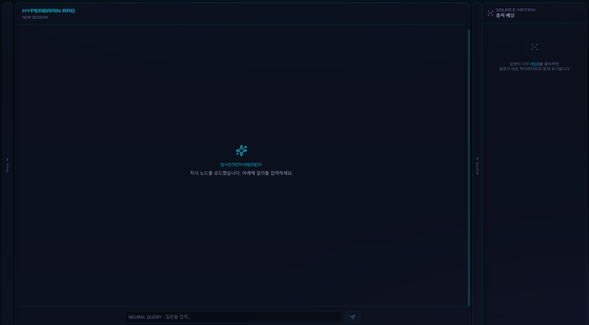

# HYPERBRAIN RAG

Sci-Fi cyber-tech Second Brain RAG — **Next.js 14 + FastAPI**

**Repository:** https://github.com/gimnamil13-collab/hyperbrain-rag



## Stack

| Layer | Tech |
|-------|------|
| Frontend | Next.js 14, Tailwind, Framer Motion |
| Backend | FastAPI, SSE streaming |
| RAG | LangChain, ChromaDB, OpenAI gpt-4o-mini |

## Layout

```
[ 지식 노드 사이드바 ] | [ 채팅 인터페이스 ] | [ 출처 패널 ]
```

## Quick Start (Windows)

1. `.env`에 `OPENAI_API_KEY=sk-...` 설정
2. **`실행.bat`** 더블클릭
3. 브라우저 `http://localhost:3000`

UI가 스타일 없이 깨져 보이면 `실행.bat clean`으로 `.next` 캐시를 지운 뒤 재시작하세요.

## Manual Dev

```powershell
# Install
npm run install:all
pip install -r backend/requirements.txt

# Run both
npm run dev
```

- API: http://localhost:8000/api/health
- UI: http://localhost:3000

## Usage

1. Left panel → **샘플 노드 로드**
2. Center → type question
3. Right panel → click citation [1][2] for source highlight

## Smoke Test

`실행.bat`으로 API(:8000) + UI(:3000) 실행 후:

```powershell
npm run smoke:test
```

자동 검증 항목:
- Health, documents, samples ingest
- Conversations CRUD
- Mount toggle
- Chat SSE (token + sources + DONE)
- Frontend 응답 (localhost:3000)

### 수동 UI 체크리스트

1. 왼쪽 **PANEL** 토글로 사이드바 열기/닫기
2. **새 세션** 생성 · 세션 전환 · 삭제
3. **샘플 노드 로드** → 채팅 입력 활성화
4. 질문 전송 → **[1][2]** 인용 · **SOURCE** 패널 자동 열림
5. 출처 카드 클릭 ↔ 채팅 인용 하이라이트

## Tests (pytest)

백엔드 API 계약 검증 (Chroma 임시 디렉터리, OpenAI mock):

```powershell
npm run test:install   # 최초 1회
npm run test
```

커버리지: health, documents CRUD/mount, conversations CRUD, chat SSE (token + sources + DONE).

## Deploy

로컬 전용 도구입니다. Railway/Vercel 실배포 설정 파일은 제거되었습니다.

환경 변수 참고: `backend/.env.example`, `frontend/.env.local.example`
